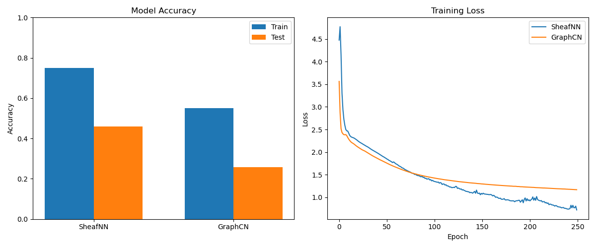

<div align="center">
  
</div>

# Sheaf Neural Networks (SNNs)

## Sheafs

A cellular sheaf on a graph G = (V, E) assigns vector spaces F(v), F(e) to vertices and edges with linear restriction maps F(v→e): F(v) → F(e) that define how information flows. 
Think of sheaves as adding local vector spaces, the stalks, to graphs and projections between those graph points, allowing data to flow like wind across the field of sheaves while maintaining local independence.

## Core Concepts

### Stalks
Vector spaces attached to nodes and edges, providing local feature spaces for independent representations:
```python
# Project input features to stalk space
h = F.relu(self.input_proj(x))  # [N, stalk_dim]
```

### Restriction Maps
Linear transformations between stalks govern how information passes to nodes:
```python
# Generate orthogonal maps using Householder transformations
F_sEe = self.householder_matrix(v_s)  # [num_edges, stalk_dim, stalk_dim]
```

### Sheaf Laplacian (L_F)
Generalizes the graph Laplacian through restriction mappings:
```
L_F = δᵀδ, where δ is the coboundary map
L_F[v,u] = -F(v→e)ᵀ F(u→e) for edge e connecting v and u
```

### Sheaf Diffusion
Information flow guided by the sheaf Laplacian:
```
Ẋ(t) = -L_F X(t)
```

## Implementation

Orthogonal restriction maps for better generalization:
```python
# Compute off-diagonal Laplacian blocks
L_sd = -torch.bmm(F_sEe.transpose(1, 2), F_dEe)

# Apply normalized sheaf diffusion
L_sd_norm = torch.matmul(torch.matmul(D_inv_sqrt[s], L_batch[i]), D_inv_sqrt[d])
out[s] = out[s] - torch.matmul(L_sd_norm, x[d])
```

## Results



In our experiments, we average over three runs, and set the following hyperparameters: layer count = 2, optimizer learning rate and weight decay = 0.01, and set the graph convolution hidden features to 64.
Our experiments demonstrate that SheafNN can offer better training and test accuracies, while also providing better losses over the course of training.

## Conclusion

In this work, we expanded Sheaf Neural Networks (SNNs) to the multi-layer setting, applied sheaf diffusion across these layers, and demonstrated that SNNs outperform GraphCN on a variety of tasks.
We utilized prior works to achieve this, including the Sheaf Laplacian, which generalizes the graph Laplacian through restriction mappings, and the Sheaf Diffusion, which guides information flow through the sheaf Laplacian.

Sheaf neural networks provide a very unique approach to modeling complex data. By extending and improving these approaches sheaf neural networks will excell in complex domains like 
drug discovery, materials science, social network analysis, financial systems, and knowledge graphs where heterophily and expressivity are key.

## References

[1] Hansen, J., & Gebhart, T. (2020). Sheaf Neural Networks. NeurIPS arXiv:2012.06333.

[2] Bodnar, C., et al. (2022). Neural Sheaf Diffusion: A Topological Perspective on Heterophily and Oversmoothing in GNNs. NeurIPS 2022. arXiv:2202.04579.

[3] Barbero, F., et al. (2022). Sheaf Neural Networks with Connection Laplacians. ICML. arXiv:2206.08702.